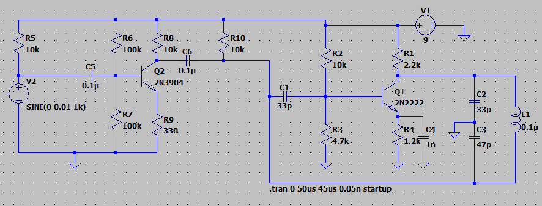
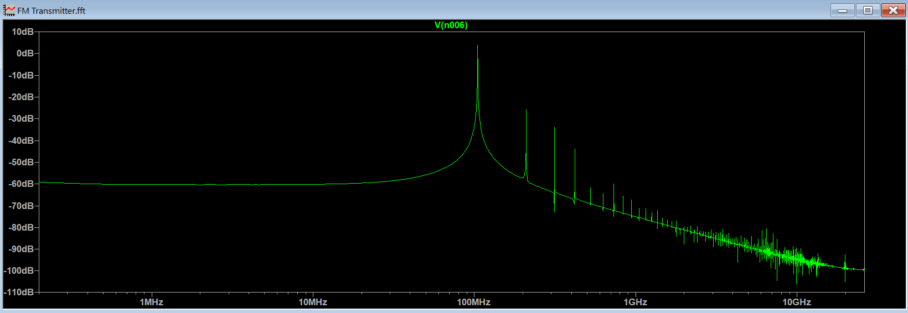
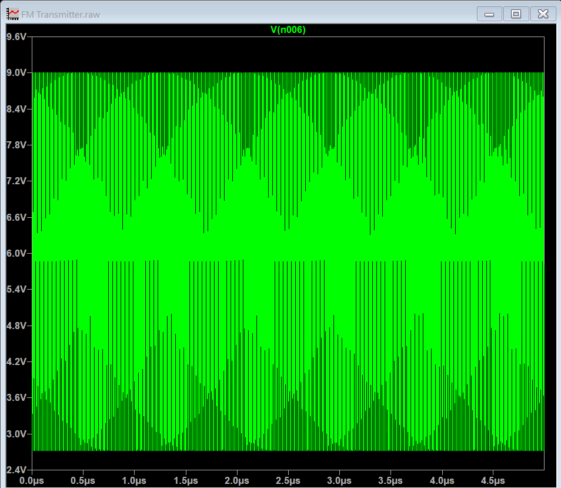
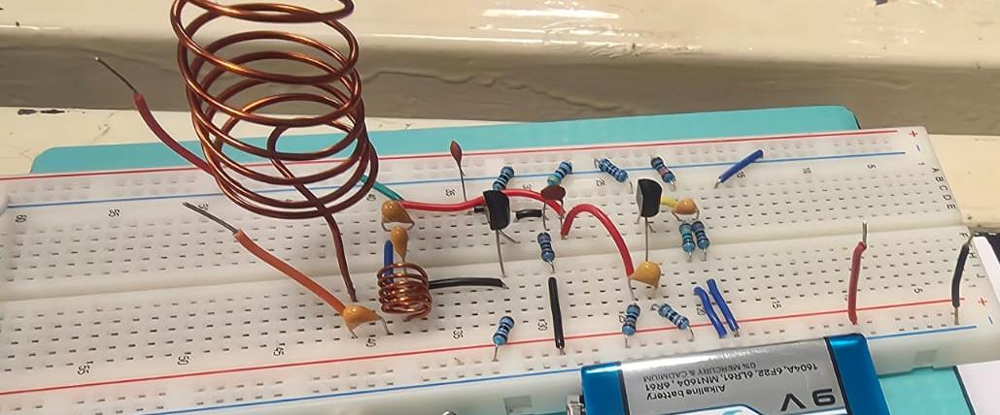
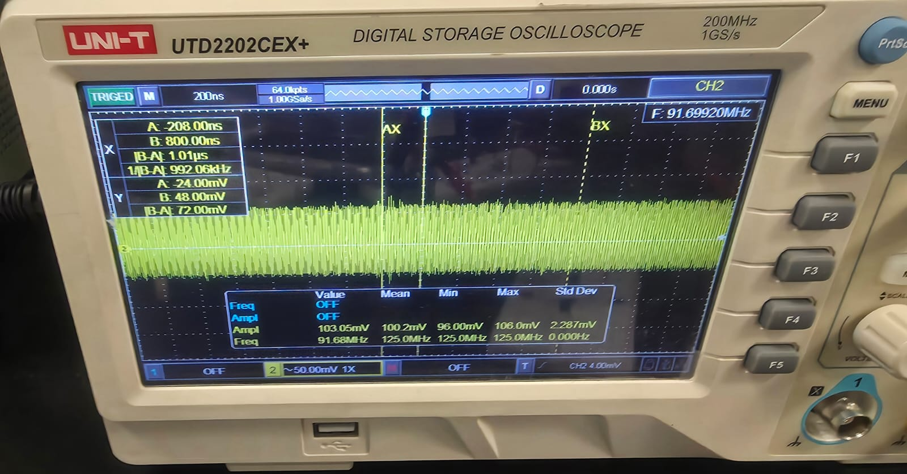

# Discrete Component FM Transmitter
## Overview
This repository contains the LTspice simulation, mathematical verification, physical breadboard implementation, and technical documentation for a two-stage FM transmitter. The circuit consists of an audio preamplifier stage coupled to a radio frequency (RF) Colpitts oscillator, which functions as a voltage-controlled oscillator (VCO) to achieve frequency modulation.

## Circuit Architecture

The design is split into two functional blocks:
1. **Audio Preamplifier (Q2 - 2N3904):** Amplifies the baseband input signal (simulated as a 1 kHz sine wave). In the physical build, this stage interfaces with an electret microphone.
2. **RF Oscillator & Modulator (Q1 - 2N2222):** A Colpitts oscillator generating the high-frequency carrier. The amplified audio signal modulates the base bias of Q1. This dynamic biasing alters the internal junction capacitances of the transistor (Cbc and Cbe), shifting the resonant frequency of the LC tank to produce FM.

## Simulation & Analysis
### 1. Fast Fourier Transform (FFT) - Carrier Frequency

The ideal resonant frequency of the LC tank (L1 = 0.1uH, C2 = 33pF, C3 = 47pF) without parasitic elements is calculated as follows:

Ceq = (33 * 47)/(33 + 47) ~ 19.38pF

fc = 1/(2 * pi * sqrt(L * Ceq)) ~ 114.3MHz

The FFT confirms a carrier frequency peak at approximately 100 MHz. The downward shift from the ideal 114.3 MHz is caused by the parallel addition of the 2N2222's internal junction capacitances to the tank circuit.

### 2. Transient Analysis & Incidental AM

The time-domain simulation reveals the modulated high-frequency carrier. Notably, the signal exhibits an amplitude envelope varying at the 1 kHz baseband frequency. 

This **incidental Amplitude Modulation (AM)** is a known artifact of simple discrete FM transmitters. Because the audio signal alters the DC operating point (bias) to achieve frequency deviation, it simultaneously changes the transistor's transconductance (gm) and loop gain, causing the output amplitude to fluctuate alongside the frequency.

## Hardware Implementation

The circuit was constructed on a standard solderless breadboard, powered by a 9V battery, and utilizing a hand-wound copper coil for both the tank inductor and the transmission antenna.

### Real-World Frequency vs. Simulation
While the LTspice simulation yielded a carrier frequency of roughly 100MHz, hardware measurements using a digital storage oscilloscope recorded a center frequency of fc ~ 91.7MHz. This further deviation is an expected result of high-frequency prototyping:
* **Breadboard Parasitics:** Solderless breadboards introduce significant stray capacitance (typically 2-5 pF between adjacent contact strips) and stray inductance, which act in parallel with the LC tank, lowering the resonant frequency.
* **Component Tolerances:** Physical ceramic capacitors and hand-wound inductors deviate from ideal SPICE models.
* **Antenna Loading:** The addition of the physical copper coil antenna loads the oscillator, altering the equivalent impedance of the resonant circuit.

## Conclusions
1. **VCO Operation via Parasitic Modulation:** Frequency modulation was successfully achieved without a dedicated varactor diode by exploiting the voltage-dependent nature of the 2N2222's internal junction capacitances. 
2. **Simulation vs. Physical Reality:** The frequency drop from 114.3MHz (ideal mathematical model) to 100MHz (SPICE simulation) and finally to 91.7MHz (physical breadboard) highlights the critical impact of parasitic parameters in VHF analog design.
3. **Design Trade-offs:** Integrating the oscillator and modulator into a single transistor stage (Q1) severely compromises signal purity. The presence of significant incidental AM proves that independent oscillator and modulation stages are necessary for high-fidelity telecommunication applications.

## Full Engineering Report
For a comprehensive analysis including complete mathematical breakdowns, physical measurements, and component justifications, please refer to the formal documentation:
[📄 Download/View Technical Report](fm-transmitter-technical-report.pdf)